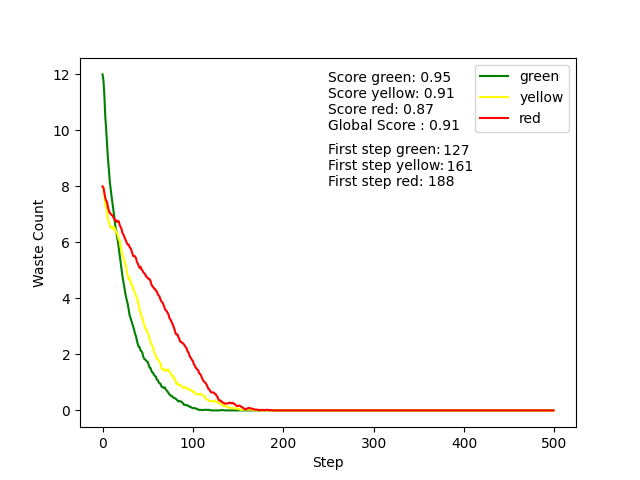
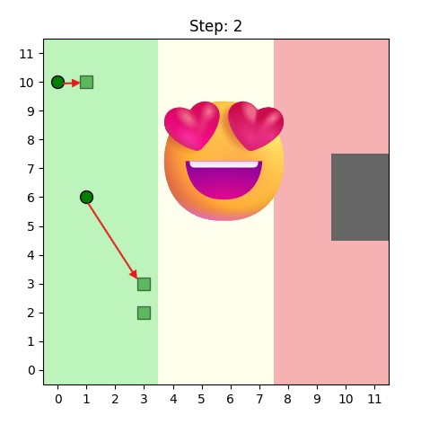

# Robot mission :rocket:

Project to clean nuclear reactors with robots.

## Installation :arrow_down:

This project is developed and tested from Python 3.9 to 3.10.
To install the required packages, run 
```bash
pip install -r requirements.txt
```

## Run the project :technologist:

To open the GUI and run single simulations, execute:
```bash
python run.py
```

The Tkinter UI allows to enter some parameters for the simulation such as:
- Number of simulation steps
- Size of the grid
- Randomness of agents: if the robots are acting with a random policy or with the implemented heuristic
- Number of robots per color
- Number of wastes per color


Click on `Run simulation` to start once you are satisfied with the parameters given.

A window with the simulation and a plot of the number of wastes will be displayed. To close it, simply click on the top-right cross.


Click on `Close simulation` in the UI to stop the script or run it again to make another simulation.

**Note**: to have a total cleanup of the map, it is required to have $(\frac{n_{greenwaste}}{2}+n_{yellowwaste}) \\% 2 = 0$ because robots can only combine 2 wastes of the same color. Obviously, the initial number of green wastes should also be divisible by 2.

## Batch simulation :chart_with_upwards_trend:

To display an average of the wastes evolution for a large number of simulations, you can run
```bash
python batch_simulation.py --n_sim=20 --steps=500 --do_random
```
Arguments:
- `n_sim`: number of simulations to compute the average at each step
- `do_random`: use random agents or not (if not, agents with the implemented heuristic will be used)
- `steps`: number of steps for each simulation

The UI and rendering of the grid will be disabled and a final plot will be displayed at the end of the simulations. AUC score is also displayed as (1-AUC) to have a metric to compare globally the behaviour of multiple agents.

Other settings such as the number of robots, wastes and the grid size can be defined in `configs/batch_config.yaml` which takes the following format:
```yaml
green_robots : 3
yellow_robots : 3
red_robots : 3
green_wastes : 12
yellow_wastes : 8
red_wastes : 8
grid_size : 20
```

## Architecture chosen

Our work is divided in several scripts that each handle different parts of the modelisation:
- `agents.py`: definition of `RobotAgent` with common behaviours and specific behaviours for Green, Yellow and Red robots
- `batch_simulation.py`: main script for experiments on multiple simulations
- `env.py`: environment agents like Waste or Radioactivity, also responsible for updating the model at each step and exchanging information with the robots
- `model.py`: supplementary layer over the environment placing all the Agents and defining updates closer to mesa formulation for running the simulation
- `run.py`: main script for running a simulation with a GUI

**Agents** used:
- RobotAgent: GreenAgent, YellowAgent, RedAgent
- WasteAgent
- RadioactivityAgent

**Environnement** - The environment contains 3 majors classes:
- `Waste(Agent)`: the Waste agent with a single attribute `color_waste`
- `Radioactivity(Agent)`: the Radioactivty agent with attributes `radioactivity_level`, `is_waste_disposal` and `is_wall` which defines "Cell agents" representing different features of the map like the level of radioactivity of each cell, the waste disposal zone or delimiting the perimeter of the area with walls.
- `Environment`: the main environment class with the method `get_info` to return an observation to the robot agent with information about its neighbours (see next paragraph on observation). The method `step` calls `get_info` to get the observation for the current position of the agent and send it back to it, it also updates the environment if the robot moves or if it moves wastes that impacts directly the map.

**Observation** - The observation returned to update the knowledge of a robot is a dictionnary containing:
- `radioactivity`: an array 3*3 containing the radioactivity value of all neighbouring cells (itself included, same for next arrays)
- `color_waste`: an array 3*3 containing the color of the wastes around the robot, if there is no waste a value of -1 is given to the cell
- `is_waste_disposal`: an array 3*3 with value 1 if it is a cell of the waste disposal zone, else -1
- `is_wall`: an array 3*3 with value 1 if the cell is a wall, else 0
- `other_robots`: an array 3*3 with value 1 if another robot is present at this cell, else 0. The center cell itself is by design given a 1.
- `success`: a boolean given the value 1 if there is no other robot in the neighbourhood (excluding the current robot iself)

**Model** - The model calls the environment, run the simulation and place all the agents:
- `RobotAgent placing`: Robots are placed randomly on the grid if they can move in it. Green agents can only be placed in the left zone, yellow in the left and middle, red everywhere. It is also endured that two robots can't be placed at the same location.
- `Radioactivity placing`: Radioactivity agents are placed on every cell with a different value according to the defined radioactivity zones (green, yellow and red). A rectangle of size 5*2 is also placed on the far right side to represent the waste disposal zone, radioactivity is the same as the red zone.
- `Waste placing`: Wastes are placed randomly on the grid in their respective zones. Two wastes can't be placed at the same location too.


## Agents evaluation methodology

### Simulation parameters

To evaluate our agent heuristics on a common ground, we've decided to set some simulation parameters across all of our experiments.
Unless stated otherwise, we've used:

```yaml
n_sim: 50
steps: 500
grid_size : 20
green_robots : 3
yellow_robots : 3
red_robots : 3
green_wastes : 12
yellow_wastes : 8
red_wastes : 8
```

We also compute mean values across 50 simulation to avoir randomness in our results

### Metrics used

We've mostly used two metrics:
- **Area under the curve (AUC)**: we compute 1 - AUC for each color to evaluate how quickly we manage to get rid of wastes
- **Completion step for each color**: The step at which all wastes for a color have been dealt with

## Agents behaviour

### Random Behaviour

The random agent adopts a very simple behavior to establish a baselines for the performances:
- If it is located on a right colored waste, it picks it
- If it is located on the waste disposal, it releases a waste it owns
- If None of the above apply, choose a random action between the following ones (without considering impossible actions):
    - Release
    - Go Up
    - Go Right
    - Go Down
    - Go Left

The results for our random walker agents are as followed:


We can see that the random agents struggle to complete their task in 500 time steps. They often struggle to find wastes to pick up, and even more to have two of them to turn it into the next color.

### First implemented heuristic

The chosen heuristic is based on the simple idea to have a common deposit slot for every robot. We define a green, yellow and red wastes deposit and they are the locations where our robots can make exchanges. Once they are defined, the robots policy is the following:

*Green agent*:
- if it carries a yellow waste, it goes to the yellow deposit and deliver the waste
- if it knows the location of a green waste, it goes and collect the waste
- if it carries a green waste, it makes its way towards the green deposit and release the waste if the deposit is empty
- if None of the above apply, the robot makes a random walk

*Yellow agent*:
- if it carries a red waste, it goes to the red deposit and deliver the waste
- if it knows the location of a yellow waste, it goes and collect the waste
- if it carries a yellow waste, it makes its way towards the yellow deposit and release the waste if the deposit is empty
- if None of the above apply, the robot makes a random walk

*Red agent*:
- if it carries a red waste, it goes to the waste disposal and deliver the waste
- if it knows the location of a red waste, it goes and collect the waste
- if None of the above apply, the robot makes a random walk
- every 15 steps of consecutive random walk, the agent goes and verify the red deposit.

The results for our heuristic show that our new agents are a clear upgrade from the random walk agents, although they struggle to fully complete the task. Indeed, yellow and even more red agents have a lot of ground to cover and the random walk process isn't enough to explore the whole map.


### Exploration upgrade

Instead of doing a random walk, we also implemented an exploration of unseen cells when the robot doesn't have a target in mind from its knowledge. This is simply done by recording explored cells and giving priority to unseen ones.

### Communication

To improve the behaviour of agents, a communication has been established between robots so they can exchange information on the grid between themselves.
The code for the mailbox and message system is implemented in the folders `mailbox` and `message`. The defined objects are directly called in the main `RobotAgent` class of `agents.py`

The `step` of an agent is modified as follows:
```python
def step(self):
        action = self.deliberate()
        percepts = self.model.do(self, action)
        other_grids = self.read_messages()
        self.update(percepts, action, other_grids)
        self.broadcast_message()
```
`broadcast_message` is a method used by a robot to send through the mailbox system two information:
- the agent current position (i,j)
- the subgrid of the neighbouring cells of this agent
These information are sent to all agents corresponding to a `RobotAgent` without distinction of color.

`read_messages` opens the mailbox to get the previously defined information which is then used in the `update` to update the internal grid of the agent with the information sent before by the other robots.

The communication implemented greatly improves the results and is faster than sending the whole grid information as a message. The grid is constantly cleaned before 200 steps for the same config used as previous experiments.


### Changes to the disposal system


Thanks to the new communication system, every agent is immediately informed when a waste item has been released. As a result, there's no longer a need to assign fixed waste disposal locations for each color—agents will automatically know where the released wastes are.

We’ve updated our agents’ behavior so that they now release waste near the edge of the radioactive zone. They head directly to the border to dispose of their waste and then communicate the exact location to the next group of agents, who can retrieve it efficiently.

This further improved the performance of our multi-agent system as the AUC scores used slightly increased and the time needed to dispose of red wastes was reduced:



### Further leveraging the potential of the communication system

So far, we've only used the communication system to help agents remember the position of wastes. We can go further, by also using the position of other agents to improve their coordination.

Let's take the following situation where two green agents are searching for a green waste:


Although both agents are closer to the waste at the top of the grid, their positions suggest that one will reach it faster. Consequently, the second agent should avoid pursuing the same target and instead redirect its efforts toward other available wastes, even if they are located farther away.



We also give priority to agents already carrying a waste, as they will directly be able to turn it into the next color and deliver their waste.

Each agent will send in their message their position and what they are carrying. Using this, other agents will etermine if they are the best suited agent to pick up a waste or not, and act accordingly. This limits the frequency of conflicts between agents aiming for a same waste.

This final upgrade in our heuristic gives the best results we've had so far, both for the AUC metric and the time needed to dispose of all wastes. 


