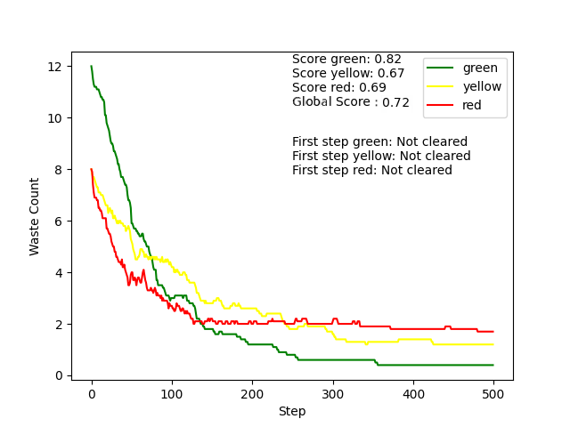

# Robot mission :rocket:

Project to clean nuclear reactors with robots.

## Installation :arrow_down:

This project is developed and tested from Python 3.9 to 3.10.
To install the required packages, run 
```bash
pip install -r requirements.txt
```

## Run the project :technologist:

To open the GUI and run single simulations, execute:
```bash
python run.py
```

The Tkinter UI allows to enter some parameters for the simulation such as:
- Number of simulation steps
- Size of the grid
- Randomness of agents: if the robots are acting with a random policy or with the implemented heuristic
- Number of robots per color
- Number of wastes per color


Click on `Run simulation` to start once you are satisfied with the parameters given.

A window with the simulation and a plot of the number of wastes will be displayed. To close it, simply click on the top-right cross.


Click on `Close simulation` in the UI to stop the script or run it again to make another simulation.

**Note**: to have a total cleanup of the map, it is required to have $(\frac{n_{greenwaste}}{2}+n_{yellowwaste}) \% 2 = 0$ because robots can only combine 2 wastes of the same color. Obviously, the initial number of green wastes should also be divisible by 2.

## Batch simulation :chart_with_upwards_trend:

To display an average of the wastes evolution for a large number of simulations, you can run
```bash
python batch_simulation.py --n_sim=20 --steps=500 --do_random
```
Arguments:
- `n_sim`: number of simulations to compute the average at each step
- `do_random`: use random agents or not (if not, agents with the implemented heuristic will be used)
- `steps`: number of steps for each simulation

The UI and rendering of the grid will be disabled and a final plot will be displayed at the end of the simulations. AUC score is also displayed as (1-AUC) to have a metric to compare globally the behaviour of multiple agents.

Other settings such as the number of robots, wastes and the grid size can be defined in `configs/batch_config.yaml` which takes the following format:
```yaml
green_robots : 3
yellow_robots : 3
red_robots : 3
green_wastes : 12
yellow_wastes : 8
red_wastes : 8
grid_size : 20
```

Some results for the previously defined configuration are shown here:

Heuristic agents:



Random agents:


## Explanations :memo:

### Architecture chosen

Our work is divided in several scripts that each handle different parts of the modelisation:
- `agents.py`: definition of `RobotAgent` with common behaviours and specific behaviours for Green, Yellow and Red robots
- `batch_simulation.py`: main script for experiments on multiple simulations
- `env.py`: environment agents like Waste or Radioactivity, also responsible for updating the model at each step and exchanging information with the robots
- `model.py`: supplementary layer over the environment placing all the Agents and defining updates closer to mesa formulation for running the simulation
- `run.py`: main script for running a simulation with a GUI

Agents used:
- RobotAgent: GreenAgent, YellowAgent, RedAgent
- WasteAgent
- RadioactivityAgent

**Environnement** - The environment contains 3 majors classes:
- `Waste(Agent)`: the Waste agent with a single attribute `color_waste`
- `Radioactivity(Agent)`: the Radioactivty agent with attributes `radioactivity_level`, `is_waste_disposal` and `is_wall` which defines "Cell agents" representing different features of the map like the level of radioactivity of each cell, the waste disposal zone or delimiting the perimeter of the area with walls.
- `Environment`: the main environment class with the method `get_info` to return an observation to the robot agent with information about its neighbours (see next paragraph on observation). The method `step` calls `get_info` to get the observation for the current position of the agent and send it back to it, it also updates the environment if the robot moves or if it moves wastes that impacts directly the map.

*Observation* - The observation returned to update the knowledge of a robot is a dictionnary containing:
- `radioactivity`: an array 3*3 containing the radioactivity value of all neighbouring cells (itself included, same for next arrays)
- `color_waste`: an array 3*3 containing the color of the wastes around the robot, if there is no waste a value of -1 is given to the cell
- `is_waste_disposal`: an array 3*3 with value 1 if it is a cell of the waste disposal zone, else -1
- `is_wall`: an array 3*3 with value 1 if the cell is a wall, else 0
- `other_robots`: an array 3*3 with value 1 if another robot is present at this cell, else 0. The center cell itself is by design given a 1.
- `success`: a boolean given the value 1 if there is no other robot in the neighbourhood (excluding the current robot iself)

Model

### Agents behaviour

Random Behaviour

The random agent adopts a very simple behavior to establish a baselines for the performances:
- If it is located on a right colored waste, it picks it
- If it is located on the waste disposal, it releases a waste it owns
- If None of the above apply, choose a random action between the following ones (without considering impossible actions):
    - Release
    - Go Up
    - Go Right
    - Go Down
    - Go Left

Implemented heuristic

The chosen heuristic is based on the simple idea to have a common deposit slot for every robot. We define a green, yellow and red wastes deposit and they are the locations where our robots can make exchanges. Once they are defined, the robots policy is the following:

Green agent:
- if it carries a yellow waste, it goes to the yellow deposit and deliver the waste
- if it knows the location of a green waste, it goes and collect the waste
- if it carries a green waste, it makes its way towards the green deposit and release the waste if the deposit is empty
- if None of the above apply, the robot makes a random walk

Yellow agent:
- if it carries a red waste, it goes to the red deposit and deliver the waste
- if it knows the location of a yellow waste, it goes and collect the waste
- if it carries a yellow waste, it makes its way towards the yellow deposit and release the waste if the deposit is empty
- if None of the above apply, the robot makes a random walk

Red agent:
- if it carries a red waste, it goes to the waste disposal and deliver the waste
- if it knows the location of a red waste, it goes and collect the waste
- if None of the above apply, the robot makes a random walk
- every 15 steps of consecutive random walk, the agent goes and verify the red deposit.

### Analysis of results

As demonstrated in the previous section with the batch simulation, the implemented heuristic for robots far outperforms the random behaviour. The metric used (1 minus AUC of collected wastes) is doubled for yellow and red wastes. Such change is less obvious with green wastes because the implemented behaviour improves how all robots retain some kind of memory but also optimizes where the green robots will place the created yellow wastes for yellow robots to pick. Similarly, yellow robots place created red wastes in a specific region for red robots so it becomes easier for them to pick these wastes and bring them to the waste deposit.

## Further work :art:

We are currently working on more features to improve robots behaviour and optimize even better the collection of wastes:
- Replace random walking by a better policy, including efficient exploration
- Set up communication between robots to exchange information about wastes placement
- Complexify the environments with varying radiation, robots battery and more