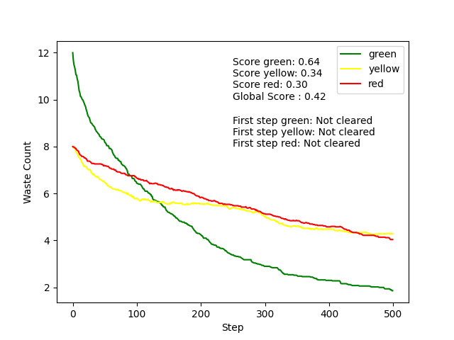

# Robot mission :rocket:

Project to clean nuclear reactors with robots.

## Installation :arrow_down:

This project is developed and tested from Python 3.9 to 3.10.
To install the required packages, run 
```bash
pip install -r requirements.txt
```

## Run the project :technologist:

To open the GUI and run single simulations, execute:
```bash
python run.py
```

The Tkinter UI allows to enter some parameters for the simulation such as:
- Number of simulation steps
- Size of the grid
- Randomness of agents: if the robots are acting with a random policy or with the implemented heuristic
- Number of robots per color
- Number of wastes per color


Click on `Run simulation` to start once you are satisfied with the parameters given.

A window with the simulation and a plot of the number of wastes will be displayed. To close it, simply click on the top-right cross.


Click on `Close simulation` in the UI to stop the script or run it again to make another simulation.

## Batch simulation :chart_with_upwards_trend:

To display an average of the wastes evolution for a large number of simulations, you can run
```bash
python batch_simulation.py --n_sim=20 --steps=500 --do_random
```
Arguments:
- `n_sim`: number of simulations to compute the average at each step
- `do_random`: use random agents or not (if not, agents with the implemented heuristic will be used)
- `steps`: number of steps for each simulation

The UI and rendering of the grid will be disabled and a final plot will be displayed at the end of the simulations. AUC score is also displayed as (1-AUC) to have a metric to compare globally the behaviour of multiple agents.

Other settings such as the number of robots, wastes and the grid size can be defined in `batch_config.yaml` which takes the following format:
```yaml
green_robots : 3
yellow_robots : 3
red_robots : 3
green_wastes : 12
yellow_wastes : 8
red_wastes : 8
grid_size : 20
```

Some results for the previously defined configuration are shown here:

Heuristic agents:


Random agents:



## Explanations :memo:

### Architecture chosen

Agents used:
- RobotAgent: GreenAgent, YellowAgent, RedAgent
- WasteAgent
- RadioactivityAgent

Environnement
 
Model

### Comportement des agents

Random Behaviour

Implemented heuristic

### Analyse des résultats

Comparison of the two agent modes